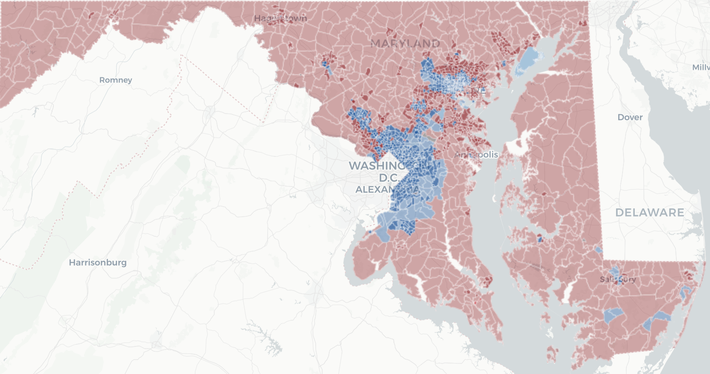

# Precinct-level results for Maryland's 2018 gubernatorial election (and county-level results for Early Voting and Absentee / Provisional Voting)

By [Christine Zhang](mailto:czhang@baltsun.com)

*This repository will be updated with additional data processing code.*

## Precinct results (Election Day vote only)

If you're looking for processed precinct-level results for Maryland's 2018 gubernatorial election, you'll find them in the `results` folder under `output/results_processed.csv`. The file contains the following columns:

- `ID`: unique precinct ID assigned by the state
- `NAME`: name of the precinct
- `county`: county in Maryland where the precinct is located
- `ghost`: = 1 if the precinct is a [ghost precinct](https://www.baltimoresun.com/news/maryland/politics/bs-md-ghost-precincts-20181030-story.html)
- `rep_voters`: number of active, qualified Republican voters as of the close of registration
- `dem_voters`: number of active, qualified Democratic voters as of the close of registration
- `lib_voters`: number of active, qualified Libertarian voters as of the close of registration
- `green_voters`: number of active, qualified Green voters as of the close of registration
- `una_voters`: number of active, qualified voters registered as Unaffiliated (aka independent) as of the close of registration
- `other_voters`: number of active, qualified voters registered with Other parties as of the close of registration 
- `active_qualified_total`: total number of active, qualified voters as of the close of registration 
- `hogan`: number of votes received by Larry Hogan and Boyd K. Rutherford
- `jealous`: number of votes received by Ben Jealous and Susan Turnbull
- `quinn`: number of votes received by Shawn Quinn and Christina Smith
- `schlakman`: number of votes received by Ian Schlakman and Annie Chambers
- `write_in`: number of votes received by all Write-In candidates
- `total_votes`: total number of votes received        
- `perc_hogan`: percentage of votes received by Larry Hogan and Boyd K. Rutherford
- `perc_jealous`: percentage of votes received by Ben Jealous and Susan Turnbull     
- `perc_quinn`: percentage of votes received by Shawn Quinn and Christina Smith       
- `perc_schlakman`: percentage of votes received by Ian Schlakman and Annie Chambers   
- `perc_write_in`: percentage of votes received by all Write-In candidates          
- `winner`: winner in precinct
- `perc_winner`: percentage of votes received by winner in precinct
- `area`: area in square meters calculated under projection EPSG:4326 - WGS 84
- `area_mi`: area in square miles
- `density`: total number of votes received per square mile
- `zipcode`: zipcodes corresponding to each precinct

The raw results file is saved in the `results` folder under `input/results_raw.csv`. These were obtained from the Maryland state Board of Elections Election Day [Precinct Results feed](https://elections.maryland.gov/elections/results_data/GG18/PrecinctResults.js). Gubernatorial results were extracted and processed using the state's [MetaData feed](https://elections.maryland.gov/elections/results_data/GG18/MetaData.js).

## Early Voting and Absentee results (by county)

> Precinct level results, and the roll-up of such data into districts based on what districts the precinct participates in, is limited by Maryland Election Law to election-day voting.  Early Voting, Absentee and Provisional vote counts are not reported at the precinct level, so those counts are only included in the county level files.

Source: [Maryland state Board of Elections](https://elections.maryland.gov/elections/using_election_data_instructions.html)

If you're looking for county-level results for Maryland's 2018 gubernatorial election, you'll find them in the `results` folder under `output/results_ev_absentee.csv`. The file structure follows the layout on the state Board of Elections [results page](https://elections.maryland.gov/county_status_page_root.html).

## Shapefiles
If you're looking for Maryland precinct shapefiles, you'll find them in the `shapefiles` folder under `md_all.zip`. The `ID` field corresponds to the `ID` column in the results file.

Shapefiles for most counties were obtained from the [Florida Election Science Team](https://doi.org/10.7910/DVN/NH5S2I) (also posted [on GitHub](https://github.com/nvkelso/election-geodata/tree/master/data/24-maryland)). For counties whose precinct boundaries have changed since 2016, the shapefiles were obtained directly from the counties. Shapefiles were combined using [QGIS](https://www.qgis.org/en/site/) and the `ID` field was generated to match the unique `ID` column in the results file.

## Community Contributions

There are many ways to present election results (see **References / Inspiration** below).

**Have questions or contributions?** Send us a [pull request](https://github.com/baltimore-sun-data/maryland-2018-governor-precinct-map/pulls) or contact us on Twitter [@baltsundata](https://twitter.com/baltsundata) or via [email](mailto:czhang@baltsun.com). You can also fork your own copy of this repo to your account.

## References / Inspiration
["California's most detailed election result map EVER"](https://github.com/datadesk/california-2016-election-precinct-maps) by the Los Angeles Times Data Viz team. [Story](http://www.latimes.com/projects/la-pol-ca-california-neighborhood-election-results/) by Jon Schleuss, Joe Fox and Priya Krishnakumar.

["There Are Many Ways to Map Election Results. We've Tried Most of Them."](https://www.nytimes.com/interactive/2016/11/01/upshot/many-ways-to-map-election-results.html) by Alicia Parlapiano at the *New York Times*.

## Licensing

All code in this repository is available under the [MIT License](https://opensource.org/licenses/MIT). The data files are available under the [Creative Commons Attribution 4.0 International](https://creativecommons.org/licenses/by/4.0/) (CC BY 4.0) license.

